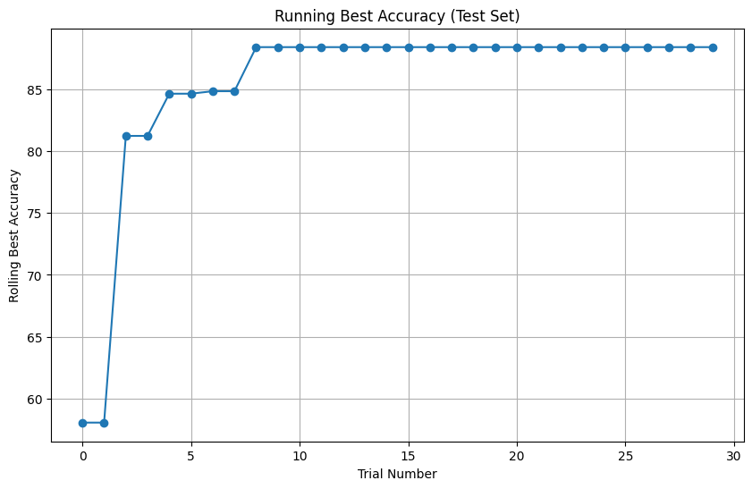

# Model Card
Prediction of whether a given pixel represents vasculature from kidney high resolution CT scan images.

## Model Description

**Input:** 
The inputs are normalised tensors of shape 5,100,100. These represent 5 layers of adjacent human kidney Hierarchical Phase-Contrast Tomography (HiP-CT) scans saved as 8 bit grayscale TIFF image. Each layer is 100x100 pixels. Padding is applied if the centrepoint (pixel to be classified) is within 50 pixels of an image border or 2 slices from the bottom or top of the image stack. This stack of 5,100,100 is referred to as the image 'chunk'. 

**Output:**
The model output is binary classification as to whether the centrepoint pixel of the image chunk is part of the vascular tree or structures. 0 represents not part of the vascular tree/structures; 1 represents a pixel that is within or part of the vascular tree. 

**Model Architecture:** 
The model is a convolutional nneural network (CNN) with the following features:
Input layer: 5 channels of size 100x100 pixels.
Convolutional Layers:
Conv1 - 32 filters of size 3x3 and padding of 1; 
Conv2 - 64 filers of size 3x3 with padding of 1.
Pooling Layer:
Down sampling of feature maps taking the maximum value over a 2x2 window with stride 2.
Dropout Layer:
A 50% dropout rate is used to prevent overfitting during training.
Fully Connected Layers:
FC1 - maps output from preceding layers to a vectors size 128;
FC2 - output layer maps 128 dimension vectors to 2 outputs (binary classification).
Activation Function:
Rectified Linear Unit (ReLU) is used throughout the model.
Weight Initialisation:
Xavier uniform initialisation is used.

## Performance

The model was evaluated using accuracy metric on other non overlapping Chunks in the Test set.
Best study and chosed model had the following parameters:
Value: 88.43537414965986
 Params: 
    learning_rate: 0.0024435642230605137
    momentum: 0.9521176292803581
    dropout_rate: 0.6827284555071912
    batch_size: 21
    

## Limitations

The model has been tested on images of kidneys only. It is unknown if this is transferable to other organs if if more training is needed. It struggles with areas outwith the organ, often creating false positives, particularly as these are surrounded by liquid in the dissections so may look similar to vascular structures. It may be useful to combine this model with a second model that can identify the borders of the organ and exclude areas outside the organ from vascular classification. This also highlights that the model hasn't been tested in vitro with living tissue and surrounding structures. Any clinical use of this approach would need further training and validation. The full set of different resolutions and HiP-CT methods has not been assessed in training this model.

## Trade-offs

This model was trained on data submitted for the Kaggle competition https://kaggle.com/competitions/blood-vessel-segmentation. The scoring for the competition looks at Surface Dice metric, not accuracy. Surface Dice metric is particularly useful for 3d segmentation task and is more informative than volume based metrics where information on boundaries and irregularly segmentated shapes is useful. 

Oversampling was used for the positive / vascular areas as these pixels represent < 1 % of the image maps in the training data. As such this model isn't yet useful to meet the competition aims as simply marking all pixels as 0 would be more than 99% accurate! F

Although this model is not currently accurate enough to be useful it nevertheless performed well on the 50/50 oversampled test data and might be a base for further improvements. Further areas of work might include adapting existing models such as vnet or using a mixed model, perhaps including a representation of the whole kidney to exclude areas obviously outside the outer perimeter of the organ. 

